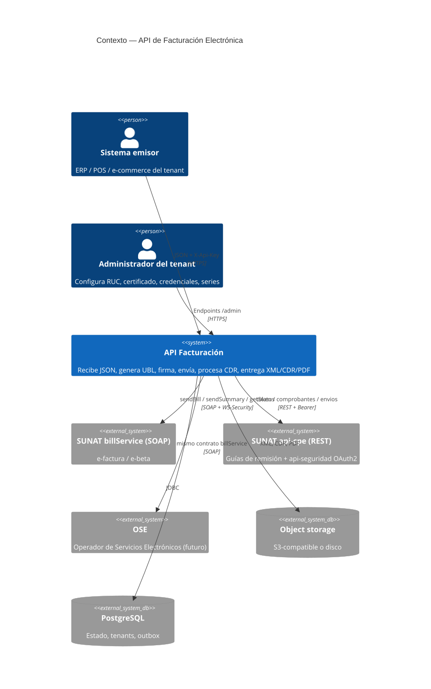

# 02 · Arquitectura

**Fecha:** 2026-09-13 · **Estado:** aprobado · Índice: [README](README.md)

---

## 1. Diagrama de contexto (C4 nivel 1)



*Fuente: [`docs/architecture/01-contexto-c4.mmd`](../../architecture/01-contexto-c4.mmd)*

---

## 2. Diagrama de componentes (hexagonal)



*Fuente: [`docs/architecture/02-componentes-hexagonal.mmd`](../../architecture/02-componentes-hexagonal.mmd)*

**Regla de dependencia:** `adapters/* → application → domain`. `bootstrap` ve todo. Los adaptadores no se conocen entre sí. `domain` y `application` no dependen de Spring, JPA, CXF ni JAXB.

**Trabajo asíncrono:** los casos de uso registran la acción pendiente en la tabla `outbox` dentro de la misma transacción que el agregado. `OutboxWorker` (adapter in-scheduler) toma filas vencidas con `FOR UPDATE SKIP LOCKED`, ejecuta el caso de uso correspondiente y reprograma con backoff exponencial. Es idempotente por estado del agregado.

### Estructura de módulos Gradle

```
factura/
├── domain/
├── application/
├── adapters/
│   ├── in-rest/
│   ├── in-scheduler/
│   ├── out-ubl/
│   ├── out-signing/
│   ├── out-sunat-soap/
│   ├── out-sunat-rest/
│   ├── out-pdf/
│   ├── out-storage/
│   ├── out-persistence/
│   └── out-crypto/
├── bootstrap/
└── docs/
```

