# 03 · Dominio y datos

**Fecha:** 2026-09-13 · **Estado:** aprobado · Índice: [README](README.md)

---

## 1. Modelo de dominio

*Fuente: [`docs/architecture/03-modelo-dominio-clases.mmd`](../../architecture/03-modelo-dominio-clases.mmd)*

### Máquina de estados

*Fuente: [`docs/architecture/04-maquina-estados.mmd`](../../architecture/04-maquina-estados.mmd)*

Reglas del dominio:

| Regla | Detalle |
|---|---|
| Serie coherente con tipo | 01→`F###`, 03→`B###`, 07/08→`F###`/`B###` según afectado, 20→`R###`, 40→`P###`, 09→`T###`, 31→`V###` |
| Numeración | Correlativa por `(tenant, tipo, serie)`, asignada bajo bloqueo de fila; **nunca reutilizable**, ni tras rechazo |
| Reenvío con mismo número | Solo desde `ERROR_ENVIO` (excepción SUNAT); desde `RECHAZADO` se exige nuevo documento |
| Factura | Receptor con RUC (tipo doc 6) |
| Boleta | Receptor DNI/otros o consumidor final; nunca `sendBill` |
| Nota | Referencia un documento `ACEPTADO*` del mismo tenant y misma clase de serie |
| Totales | Suma de líneas = totales declarados (tolerancia 0.01) |
| RC | ≤500 líneas; `RC-YYYYMMDD-N` con fecha de generación |
| RA | Solo documentos serie F en `ACEPTADO*`; `RA-YYYYMMDD-N` |
| Anulación boleta | Vía RC con condición 3, nunca RA |

---

## 2. Modelo de datos (MER)

*Fuente: [`docs/architecture/05-modelo-datos-mer.mmd`](../../architecture/05-modelo-datos-mer.mmd)*

Notas de persistencia:

- Toda tabla de negocio lleva `tenant_id`; los repositorios lo exigen como parámetro (no hay consultas sin tenant).
- `UNIQUE (tenant_id, tipo, serie, numero)` en `DOCUMENTO`; `UNIQUE (tenant_id, idempotency_key)` parcial (donde no nulo).
- `SERIE.ultimo_numero` se incrementa con `SELECT … FOR UPDATE` dentro de la transacción de emisión.
- Índices: `DOCUMENTO (tenant_id, estado)`, `DOCUMENTO (tenant_id, fecha_emision)`, `OUTBOX (siguiente_intento) WHERE locked_until IS NULL`.
- Secretos cifrados con AES-256-GCM; la clave maestra viene de variable de entorno o KMS (`SecretCipher`).
- Archivos XML/CDR/PDF en `DocumentStorage`; clave = `{tenant}/{yyyy}/{MM}/{nombreArchivo}.{xml|cdr.xml|pdf}`.
- JPA `InheritanceType.JOINED` para `DOCUMENTO` y sus especializaciones.

