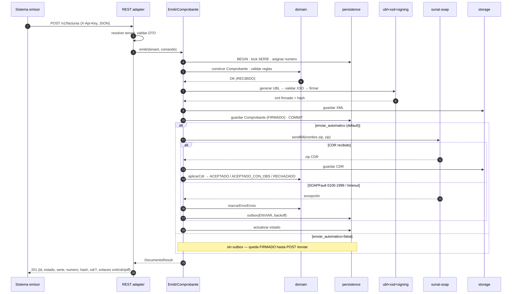
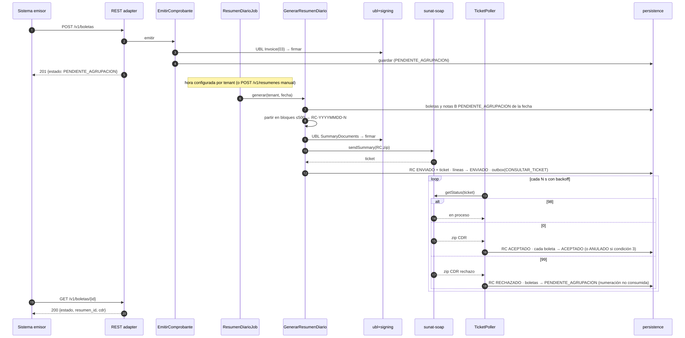
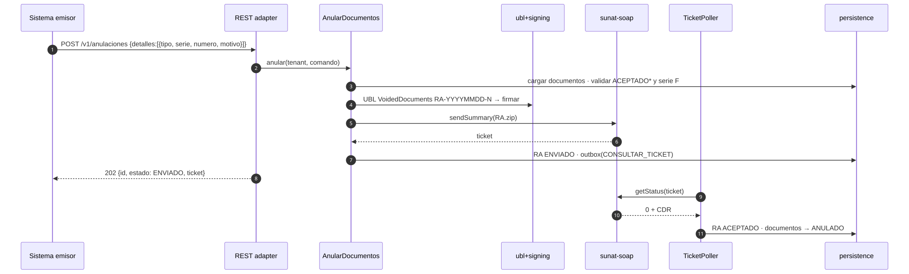
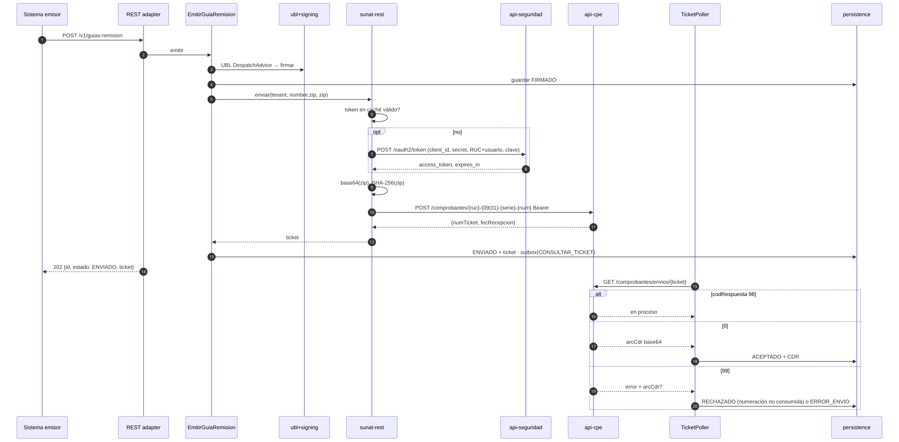
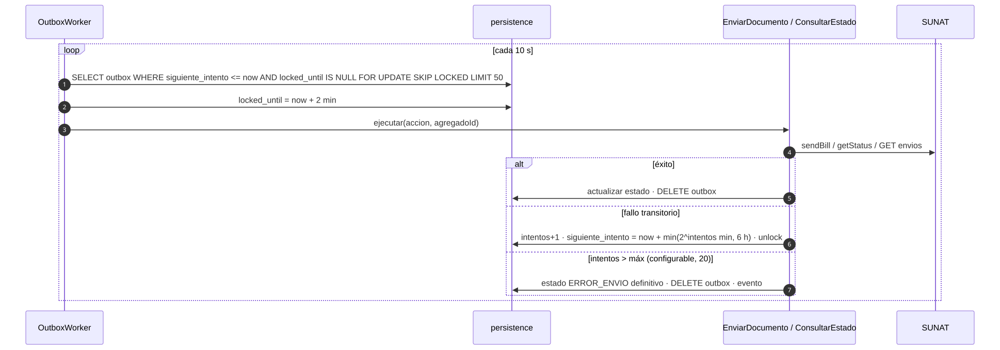

# 04 · Flujos con SUNAT

**Fecha:** 2026-09-13 · **Estado:** aprobado · Índice: [README](README.md)

---

## 1. Diagramas de secuencia

### 1.1 Factura (síncrono, `sendBill`)

*Fuente: [`docs/architecture/06-seq-factura-sincrona.mmd`](../../architecture/06-seq-factura-sincrona.mmd)*

### 1.2 Boleta → Resumen Diario → ticket

*Fuente: [`docs/architecture/07-seq-boleta-resumen-diario.mmd`](../../architecture/07-seq-boleta-resumen-diario.mmd)*

### 1.3 Comunicación de Baja (RA)

*Fuente: [`docs/architecture/08-seq-comunicacion-baja.mmd`](../../architecture/08-seq-comunicacion-baja.mmd)*

### 1.4 Guía de Remisión (REST + OAuth2)

*Fuente: [`docs/architecture/09-seq-guia-remision-rest.mmd`](../../architecture/09-seq-guia-remision-rest.mmd)*

### 1.5 Reintento por outbox

*Fuente: [`docs/architecture/10-seq-reintento-outbox.mmd`](../../architecture/10-seq-reintento-outbox.mmd)*

