# 07 · Despliegue y operación

**Fecha:** 2026-09-13 · **Estado:** aprobado · Índice: [README](README.md)

---

## 1. Despliegue



*Fuente: [`docs/architecture/11-despliegue.mmd`](../../architecture/11-despliegue.mmd)*

- Un solo artefacto (`bootstrap` → jar → imagen OCI). Réplicas horizontales seguras porque el scheduler usa `FOR UPDATE SKIP LOCKED` y el correlativo se asigna con bloqueo de fila.
- Configuración por variables de entorno: `DB_URL`, `STORAGE_TYPE` (`fs`|`s3`), `MASTER_KEY`, `PLATFORM_ADMIN_KEY`, `SUNAT_BETA_*`/`SUNAT_PROD_*` (URLs), `OUTBOX_MAX_INTENTOS`.
- Perfiles Spring: `local` (docker-compose: PostgreSQL + MinIO), `test`, `prod`.
- Migraciones Flyway al arrancar. Health: `/health` (BD, storage, último ciclo del scheduler).
- Métricas clave: documentos por estado, latencia `sendBill`, tickets pendientes por antigüedad, errores SUNAT por código, tamaño y antigüedad del outbox.

### 1.1 Modo self-hosted (instalación en el cliente)

La misma imagen OCI opera en dos modos, seleccionados por `APP_MODE`:

| Aspecto | `multi` (SaaS) | `single` (self-hosted) |
|---|---|---|
| Tenants | N, creados por `/admin/tenants` | 1, creado al arrancar desde `TENANT_RUC`, `TENANT_RAZON_SOCIAL`, `TENANT_ENTORNO` o por CLI |
| Endpoint `/admin/tenants` | Activo | Deshabilitado (404) |
| Storage por defecto | S3 | Disco local (`STORAGE_TYPE=fs`, volumen montado) |
| Clave maestra `MASTER_KEY` | Secreto de plataforma / KMS | Generada en la instalación y custodiada por el cliente |
| Rate limiting | Por API key | Opcional, desactivado por defecto |

**Provisionamiento por CLI** (`bootstrap` con perfil `cli`, mismo jar/imagen):

```
factura init --ruc 20123456789 --razon-social "…" --entorno BETA
factura certificado --archivo cert.pfx --clave ****
factura credenciales-sol --usuario MODDATOS --clave ****
factura api-key crear         → imprime la API key una sola vez
```

**Paquete de distribución** (carpeta `dist/` del repositorio, publicada con cada release):

- `docker-compose.yml` (app + PostgreSQL + volumen de storage) y `.env.example`.
- Chart Helm equivalente para Kubernetes.
- `INSTALACION.md`: requisitos mínimos (Docker 24+, 2 vCPU, 4 GB RAM, 50 GB disco, salida a `*.sunat.gob.pe:443`), pasos, actualización (`docker compose pull && up -d`; Flyway migra automáticamente), backup (`pg_dump` + copia del volumen de storage) y restauración.
- Dashboards Grafana (JSON) y reglas de alerta de ejemplo.
- Soporte de proxy corporativo: `HTTPS_PROXY`, `NO_PROXY` respetados por los adaptadores SOAP y REST.

**Garantías hacia el cliente:** ninguna comunicación saliente salvo SUNAT/OSE; sin telemetría; compatibilidad de migraciones hacia atrás una versión para permitir rollback de imagen.

**No soportado en v1:** instalación nativa sin contenedores (el jar funciona con Java 21, pero fuera de soporte); alta disponibilidad multi-nodo la configura el cliente con réplicas del mismo contenedor.

